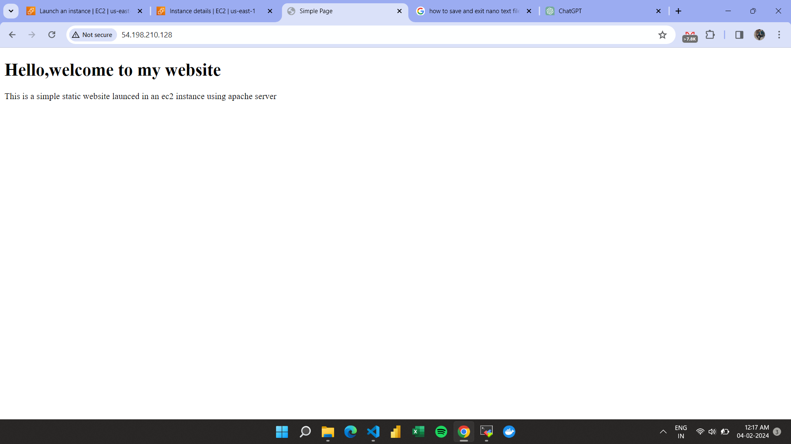

# Project Title: Apache Web Server Deployment on AWS EC2

## Overview

This project demonstrates the setup and deployment of a static website using Apache web server on an EC2 instance in AWS.

## Steps to Deploy

### 1. Create an EC2 Instance in AWS

- Launch a new EC2 instance with the following configurations:
  - AMI: Ubuntu
  - Instance Type: t2.micro
  - Key Pair: Provide a key pair
  - Network Settings: Enable SSH, HTTP, and HTTPS

  
  

- Launch the instance.

### 2. SSH into the Instance and Update Packages

```bash
ssh -i your-key-pair.pem ubuntu@instance-public-ip
sudo apt update
sudo apt upgrade
```

### 3. Install Apache Web Server

```bash
sudo apt install apache2
apache2 -v
```

  

### 4. Start Apache Server and Check Status

```bash
sudo service apache2 start
sudo service apache2 status
```

### 5. Access Apache Web Server Page

Copy the public IP of the instance and open it in a web browser. The default Apache web page should be displayed.

### 6. Replace Default HTML Page

```bash
cd /var/www/html
sudo rm index.html
sudo vi index.html
```

Use the vi text editor to replace the default HTML content with your static website.

### 7. Restart Apache Server

```bash
sudo service apache2 restart
```

### 8. Access Your Website

Use the public IP of the instance to access your website in the web browser.

  

## Conclusion

Your Apache web server is now hosting your static website on the AWS EC2 instance. Make sure to secure your instance and handle sensitive information responsibly.


